Evidència 2 — Processador
Informació del processador

En aquesta evidència analitzarem el processador de l'ordinador i les seves principals característiques:

Mira quin procesador tens i digues la litografia (busca que és), nombre de nuclis i freqüència de treball que té. Digues per a cadascun d’aquests aspectes que són i en que incideixen en el rendiment de l’ordinador.

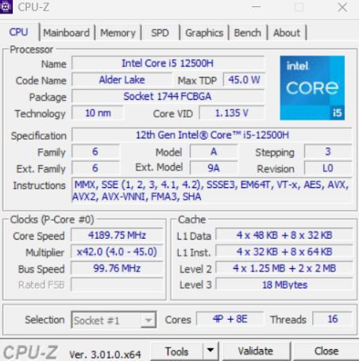 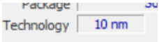

la litografia és el procés de fabricació utilitzat per imprimir els circuits microscòpics sobre una hòstia de silici
Nombre de nuclis: 8 i 16 threads

-són les unitats de processament que té la CPU. Cada nucli pot executar instruccions i treballar en tasques. En general, disposar de més nuclis permet executar més tasques simultàniament i pot millorar el rendiment en programes que aprofiten el processament. 

Frequencia: 

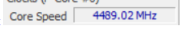

La freqüència de la CPU indica la velocitat a la qual funciona el processador 

---

Que és el benchmarking? Fes una prova de rendiment (benchmark) del procesador 
que tens a l’ordinador. Després fes una prova de rendiment de la gràfica integrada.

Que és el benchmarking? és un procés que consisteix a executar proves estandarditzades sobre un component o sistema informàtic per mesurar-ne el rendiment.

 
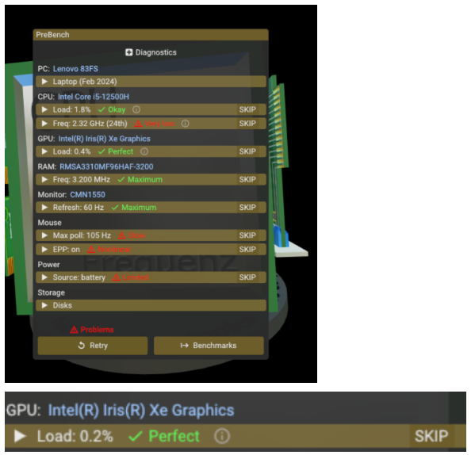

Mostrar el consum de recursos de l’ordinador CPU, RAM, xarxa, disc, gràfica, etc. sense tenir cap programa funcionant, amb el navegador obert i amb el programa de benchmark en funcionament.

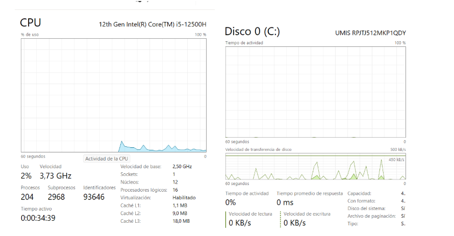

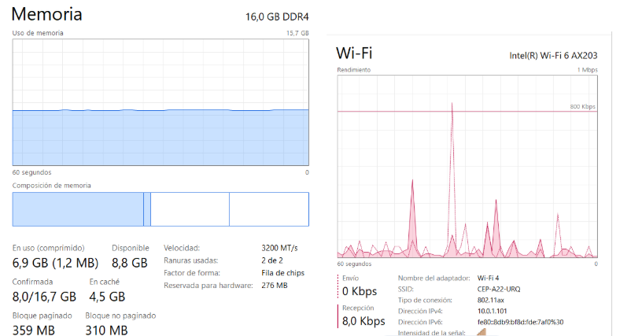

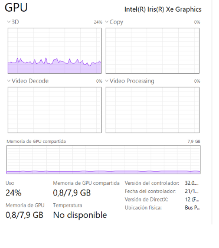

Comprova la velocitat d’internet que tenim disponible. 1MBPS I DE MITJA 800 KBPS

Que és la memòria cau (caché)?. Comprova quin espai de caché té cada tipus de caché del teu ordinador. Cerca com visualitzar l'espai que està ocupat per la caché al teu ordinador.
Què és la memòria cau (cache)? La memòria cau és una memòria de molt alta velocitat que emmagatzema temporalment dades i instruccions que el processador 

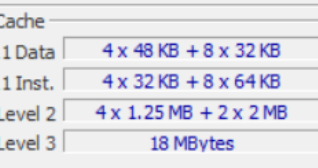

L1 És la memòria cau més ràpida i està molt a prop dels nuclis. Té poca capacitat.
L2 És més gran que L1 però una mica més lenta.
L3 Normalment és més gran que L1 i L2 i pot ser compartida entre diversos nuclis.

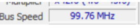

Que és el bus frontal de l’ordinador? Comprova  la velocitat del bus frontal del nostre ordinador.
0El Front Side Bus (FSB) és un bus que, en arquitectures antigues, comunicava el processador amb el chipset i altres components del sistema. 

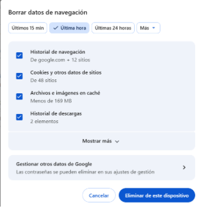

Utilitza l’eina de diagnòstic del fabricant del procesador.
Comprova la temperatura dels components de l’ordinador.

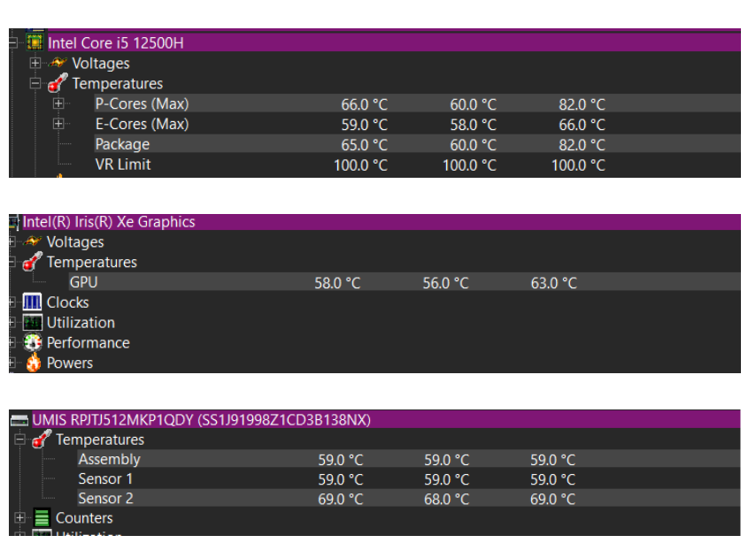

---

