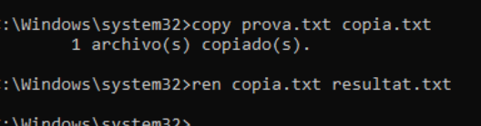
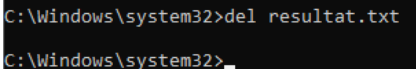
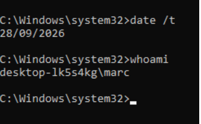
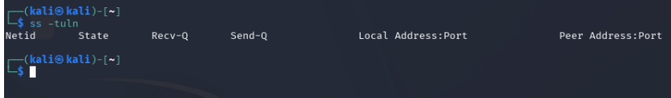
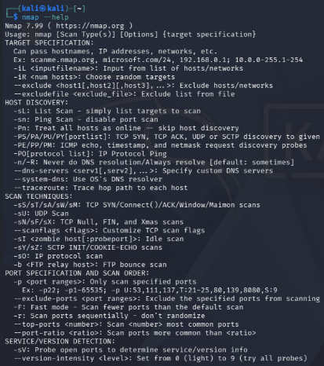

# Evidència 2: Comandes bàsiques
Marc Jurado

---
## WINDOWS:

carpeta anomenada practica a Linux amb mkdir practica i entra-hi amb cd practica. Comprova on ets amb pwd i mostra’n el contingut amb ls. 

---

Crear prova.txt i veure’l

---

Copiar, renombrar i esborrar 

---

Afegir línies i cercar paraula 

---

Consultes del sistema 

---

## KALI

Crear carpeta i comprovar 

---

Crear prova.txt i veure’l 

---

Copiar, renombrar i esborrar 

 

---

Afegir línies i cercar paraula 

---

Consultes del sistema 

  

---

NMAP KALI

---

Comparar amb ss 

---

Opcions de nmap i escaneig amb serveis 

 

---

