# Evidència 2: Comandes bàsiques

Marc Jurado

***

carpeta anomenada practica a Linux amb mkdir practica i entra-hi amb cd practica. Comprova on ets amb pwd i mostra’n el contingut amb ls.

<figure>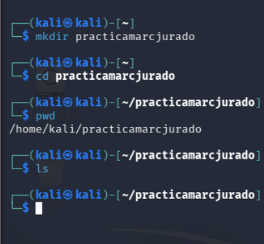<figcaption></figcaption></figure>

***

Crear prova.txt i veure’l

<figure>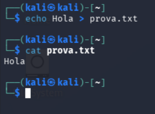<figcaption></figcaption></figure>

***

Copiar, renombrar i esborrar

<figure>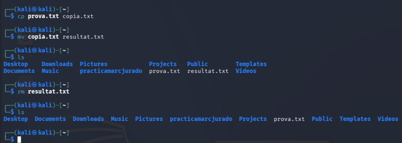<figcaption></figcaption></figure>

***

Afegir línies i cercar paraula

<figure>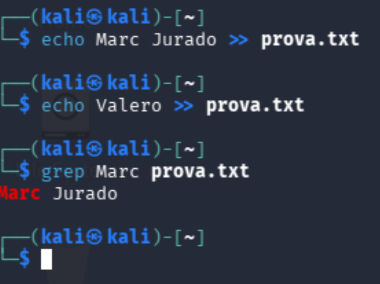<figcaption></figcaption></figure>

***

Consultes del sistema

<figure>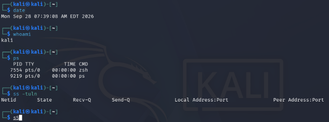<figcaption></figcaption></figure>

Crear carpeta i comprovar

<figure>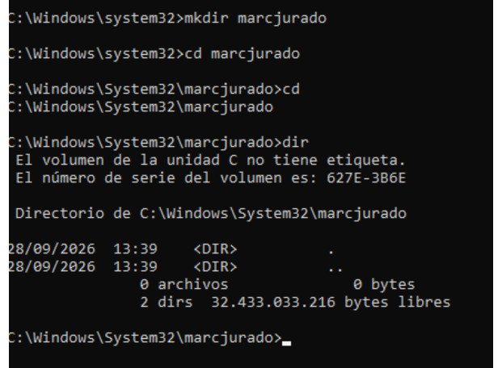<figcaption></figcaption></figure>

***

Crear prova.txt i veure’l

<figure>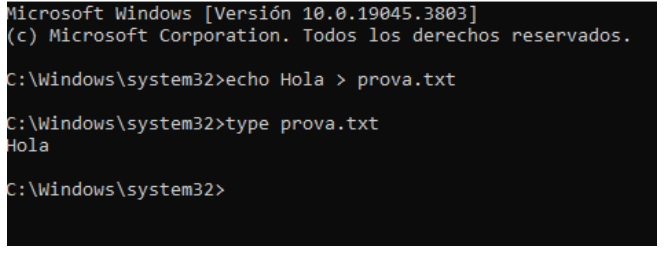<figcaption></figcaption></figure>

***

Copiar, renombrar i esborrar

<figure><figcaption></figcaption></figure>

<figure><figcaption></figcaption></figure>

***

Afegir línies i cercar paraula

<figure>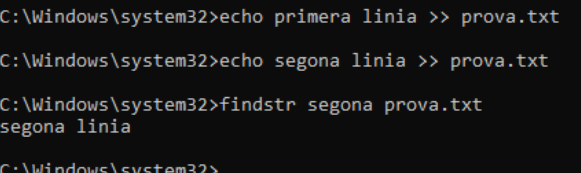<figcaption></figcaption></figure>

***

Consultes del sistema

<figure><figcaption></figcaption></figure>

<figure>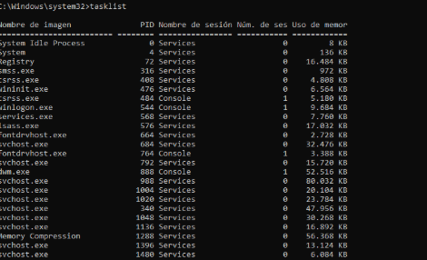<figcaption></figcaption></figure>

***

NMAP KALI

<figure>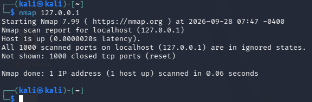<figcaption></figcaption></figure>

***

Comparar amb ss

***

<figure><figcaption></figcaption></figure>

Opcions de nmap i escaneig amb serveis

<figure><figcaption></figcaption></figure>

<figure>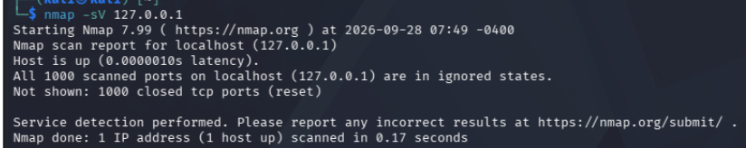<figcaption></figcaption></figure>

***
