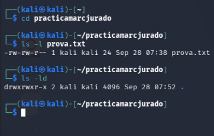
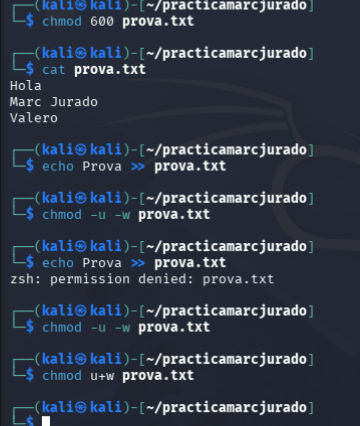
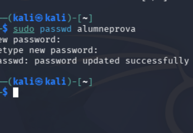
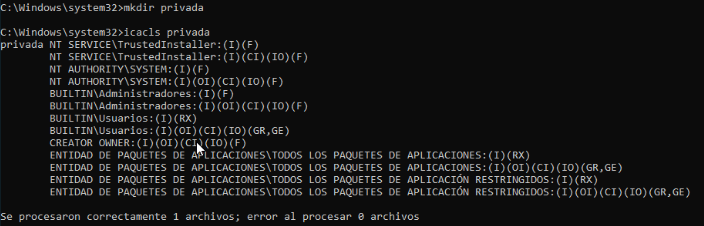
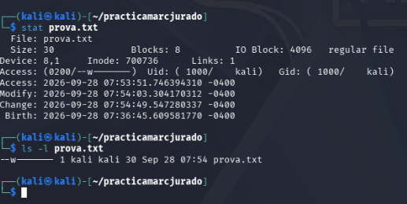
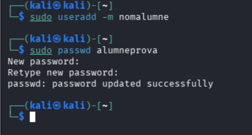
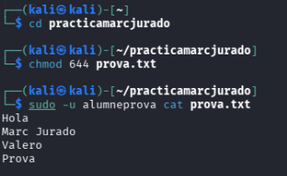

# Evidència 3: Permisos

Marc Jurado

***

## KALI

Consultar permisos inicials

<figure><figcaption></figcaption></figure>

***

Canviar permisos de prova.txt

<figure><figcaption></figcaption></figure>

***

Carpeta privada

<figure><figcaption></figcaption></figure>

***

Crear segon usuari

***

<figure><figcaption></figcaption></figure>

<figure><figcaption></figcaption></figure>

## WINDOWS

Consultar permisos de prova.txt

<figure><figcaption></figcaption></figure>

***

Carpeta privada

<figure><figcaption></figcaption></figure>

***

Crear usuari local

<figure><figcaption></figcaption></figure>

***

Donar permís de lectura a alumneprova

<figure><figcaption></figcaption></figure>

***

## A Kali (amb segon usuari)

<figure><figcaption></figcaption></figure>

***

Crear usuari nou

***

<figure><figcaption></figcaption></figure>

Proves amb diferents permisos

<figure><figcaption></figcaption></figure>

***
