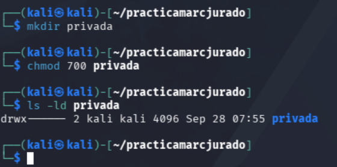
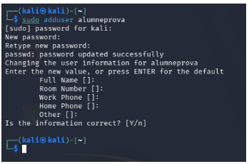
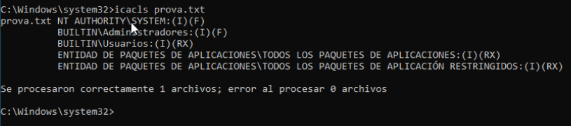
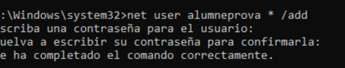
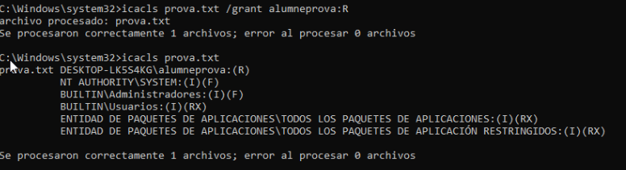

## Evidència 3: Permisos
Marc Jurado

---
# KALI

Consultar permisos inicials 

---

Canviar permisos de prova.txt 

---

Carpeta privada

---

Crear segon usuari

 

---

# WINNDOWS

Consultar permisos de prova.txt

---

Carpeta privada 

---

Crear usuari local 

---

Donar permís de lectura a alumneprova 

---

# A Kali (amb segon usuari) 

---

Crear usuari nou

---

Proves amb diferents permisos 

 

---

